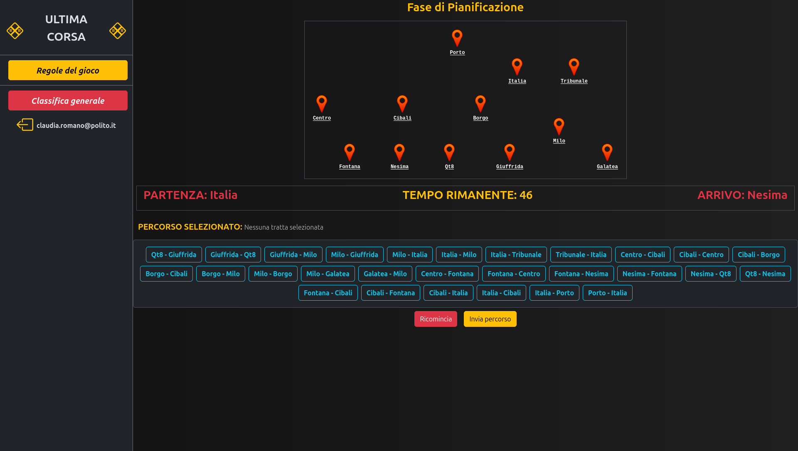
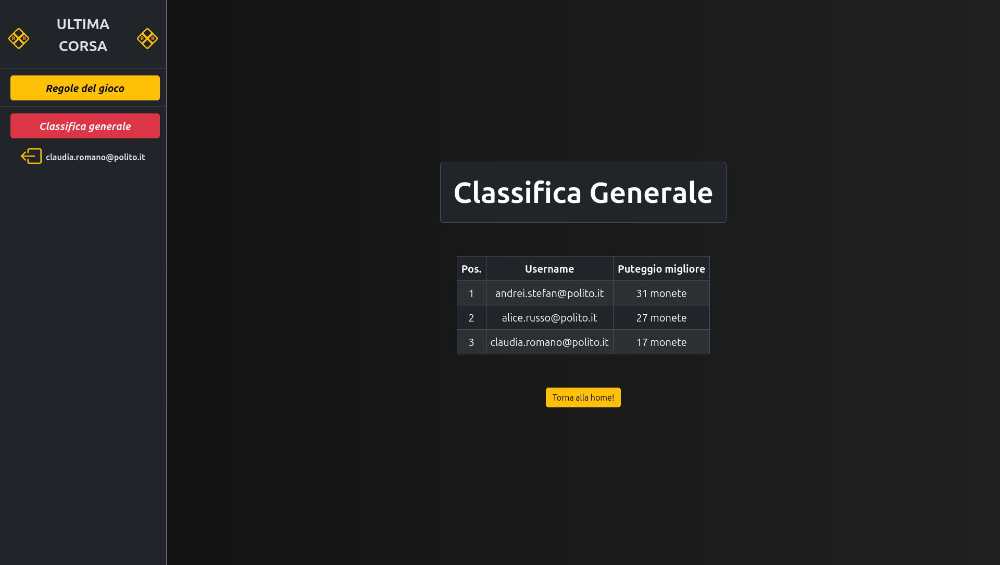

[](https://classroom.github.com/a/iZes9Qfg)

# Exam #1: "Ultima Corsa"

## Student: S356980 STEFAN ANDREI DANIEL 


## React Client Application Routes

- Route `/`: it contains the title of the game and the a button used for the navigation to the login page. When logged in, user plays the game on this route.
- Route `/login`: it contains the login form used to create the session.
- Route `/leaderboard`: it contains a table which shows the best scores of all registered users who successfully played some games.
- Route `*`: it contains the 404 Not Found error, if a non-specified route is requested.


## API Server

### Login
[POST] `/api/sessions` - Create a new session (login). Returns the  user's username.

Request body: A JSON object with username (as email) and password.
  ```json
  {
    "username" : "andrei.stefan@polito.it",
    "password" : "andreipsw"
  }
  ```

Response: `201 Created` (success), `401 Unauthorized` (invalid credentials), `400 Bad Request` (if username or password fields are missing).

Response body: A JSON object containing the username.
  ```json
  {
    "username": "andrei.stefan@polito.it"
  }
  ```


### Check if still logged in
[GET] `/api/sessions/current` - Check if the user is still logged in.

Response: `200 OK` (success), `401 Unauthorized` (Not authenticated). 

Response body: A JSON object containing the username and the related id.
  ```json
  {
    "id" : 1,
    "username": "andrei.stefan@polito.it",
  }
  ```


### Logout
[DELETE] `/api/sessions/current` - Delete the current session (logout).

Response: `200 OK` (success).


### List all the stations
[GET] `/api/stations` - List all the stations.

Response: `200 OK` (success), `500 Internal Server Error` (failure), `401 Unauthorized` (user not logged in)

Response body: A JSON object containing the list of the stations.
  ```json
  [
    {
      "station_id": 1,
      "station_name": "Fontana"
    },
    {
      "station_id": 2,
      "station_name": "Nesima"
    },
  ]
  ```


### List all the routes
[GET] `/api/routes` - List all the routes.

Response: `200 OK` (success), `500 Internal Server Error` (failure), `401 Unauthorized` (user not logged in)

Response body: A JSON object containing the list of the routes.
  ```json
  [
    {
      "route_id": "Linea Arancione-3-7",
      "line_name": "Linea Arancione",
      "from_station_id": 3,
      "from_station_name": "Qt8",
      "to_station_id": 7,
      "to_station_name": "Giuffrida"
    },
    {
      "route_id": "Linea Arancione-7-3",
      "line_name": "Linea Arancione",
      "from_station_id": 7,
      "from_station_name": "Giuffrida",
      "to_station_id": 3,
      "to_station_name": "Qt8"
    }
  ]
  ```


### Start the game and get game information
[POST] `/api/games` - Create a new game.

Response: `201 Created` (success), `401 Unauthorized` (user not logged in), `500 Internal Server Error` (failure).

Response body: A JSON object containing the id of the game and the selected start and end stations.
  ```json
  {
    "game_id": 43,
    "random_start_station_id": 4,
    "random_end_station_id": 1
  }
  ```


### Send the planned route for validation
[POST] `/api/games/:id/validate` - Send the planned route by the user.

Request body: A JSON object containing the selected route.
  ```json
  {
    "path": [1, 2, 3, 4]
  }
  ```

Response: `200 OK` (success), `401 Unauthorized` (user not logged in), `408 Request Timeout` (timeout) `500 Internal Server Error` (failure), `400 Bad Request` (start/end stations aren't the same or path too short), `404 Not Found` (if the id of the game doesn't exists on database), `422 Unprocessable entity` (if `path` is not specified).

Response body: A JSON object containing the list associated events and final coins.
  ```json
  {
    "final_coins": 1,
    "events": [
      {
        "description": "Porte che continuano a riaprirsi",
        "effect": -1
      },
      {
        "description": "Vagone vuoto",
        "effect": 3
      },
    ]
  }
  ```


### Get the leaderboard
[POST] `/api/leaderboard` - Retrieve the leaderboard with top scores of users.

Response: `200 OK` (success), `401 Unauthorized` (user not logged in), `500 Internal Server Error` (failure)

Response body: A JSON object containing the leaderbord (if exists) or object with empty array (if there aren't played games).
  ```json
  {
    "entries": [
      {
        "game_id": 1,
        "username": "andrei.stefan@polito.it",
        "score": 29
      },
      {
        "game_id": 3,
        "username": "alice.russo@polito.it",
        "score": 25
      }
    ]
  }
  ```


## Database Tables

- Table `events` - contains the list of all possible events with their effect:
  - columns: `event_id, description, effect`
- Table `games` - contains the history of all games (score, start time, start/end stations) by any user who starts a game.
  - columns: `game_id, user_id, score, start_time, start_station_id, end_station_id`
- Table `routes` - contains default routes with line name, station id and a stop sequence in a specific line.
  - columns: `route_id, line_name, station_id, stop_sequence`
- Table `stations` - contains the list of all available stations. 
  - columns: `station_id, station_name`
- Table `users` - contains the list of registered users and their credentials.
  - columns: `user_id, username, password, salt`


## Main React Components

- `Layout` (in `Layout.jsx`): used for the rendering of the default layout used by any other components
- `Homepage` (in `Homepage.jsx`): used for anonymous users in order to allow the login phase. It has the game title and a button which redirects to the login page.
- `LoginPage` (in `LoginPage.jsx`): contains a form which allow anonymous users to log in.
- `GameplayPage` (in `GameplayPage.jsx`): contains the main logic. It has got a global status of the entire gameplay. It is used to render child components for each game phase (`SetupPhase[.jsx]`, `PlanningPhase[.jsx]`, `GameplayPhase[.jsx]`, `ResultsPhase[.jsx]`).
- `LeaderboardPage` (in `LeaderboardPage.jsx`): Contains the leaderboard of the game.
- `Sidebar` (in `Sidebar.jsx`): contains some buttons: show game rules, redirect to the leaderboard. When logged in, the logout button and username are rendered.


## Screenshot

During a game: 
Leaderboard: 


## Users Credentials

| username | password | description |
| -------- | -------- | ---- |
| andrei.stefan@polito.it | andreipsw | played some games successfully |
| alice.russo@polito.it | alicepsw | played some games successfully |
| claudia.romano@polito.it | claudiapsw | played one game successfully |
| antonella.ferrari@polito.it | antonellapsw | no games played |


## Use of AI Tools
I used Google Gemini PRO for brainstorming about:
- distance calculation algorithm between 2 stations in a graph.
- conceptual UI and colors.